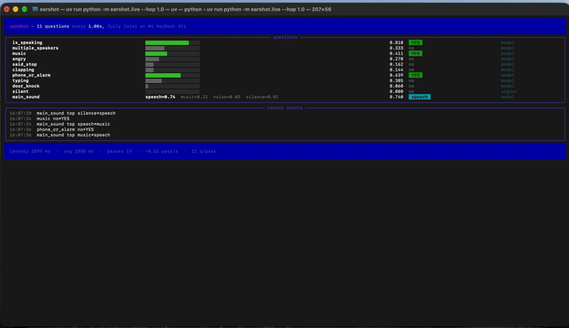
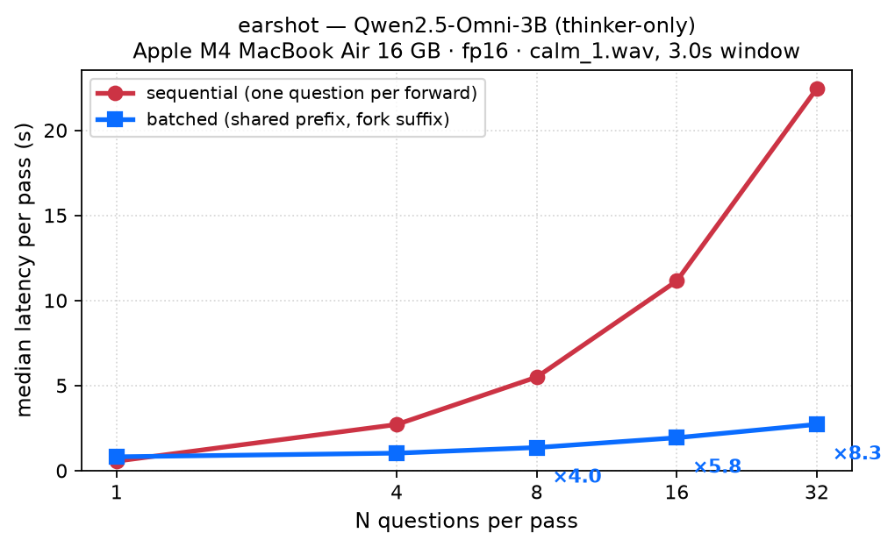
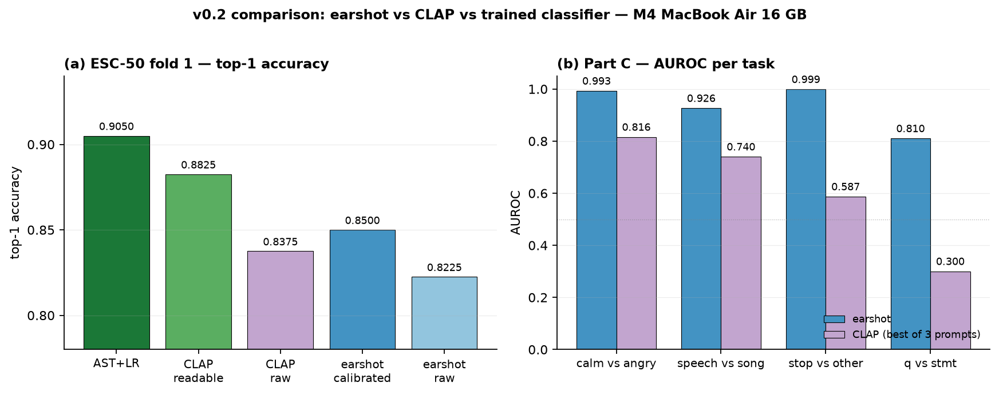

# earshot

Ask many yes/no questions about the last 3 seconds of audio, answered in one batch, fully local on a MacBook Air.



earshot encodes the last 3 seconds of microphone audio once, then answers many yes/no and multiple-choice questions against that same state in a single batch. It reads each answer as the model's probability of "Yes" instead of generating text. Silence is detected straight from the audio level; everything else comes from Qwen2.5-Omni-3B.

On a fanless M4 MacBook Air (16 GB), 11 questions take about 1.5 s per pass, and 32 questions take 2.7 s instead of 22 s when asked one at a time.

Write-up with every measurement and bug: [hrushiyadav.com/blog/earshot](https://hrushiyadav.com/blog/earshot).

## What this is, and what it isn't

- **The idea isn't new.** Prefix caching is standard in LLM serving, reading the probability of "Yes" is a known classification trick, and [Vertix](https://github.com/drxddy/vertix) did this for vision. earshot applies it to audio, locally, with a test showing the batched answers match one-at-a-time answers to within fp16 rounding (max difference 0.0074), plus a control that must fail (0.0935 with deliberately wrong positions).
- **It's not a trained decision model** like TypeSafe's [Jev](https://typesafe.ai/blog/introducing-system-one-models-and-jev). It runs on an off-the-shelf model; its probabilities are *not* calibrated probabilities — 0.8 means the model leans towards "Yes", not that it's right 80% of the time. ([Calibration](results/v02_comparison.md) helps on a 50-way task but does not make individual probabilities trustworthy.)
- **It's not a voice model.** It doesn't transcribe or speak. It's a small decision layer that could sit next to one.
- **For fixed sound labels, dedicated classifiers are faster and more accurate** (see [Earshot vs CLAP vs a trained classifier](#earshot-vs-clap-vs-a-trained-classifier) below). earshot is the right choice when the question is about *what was said* or *how it was said*.
- **It's tested on 21 short clips I recorded.** Treat the accuracy numbers as "it works", not as a benchmark.

## Why batch the questions?

| | One question at a time | earshot |
| --- | --- | --- |
| Audio processing | Repeated for every question | Once per window, shared by all questions |
| 32 questions (3 s window) | 22.5 s | 2.7 s |
| Output | Free text to parse | A probability per question |
| Format errors | Possible | Not possible: only the Yes/No (or option) scores are read |

## Setup

```bash
# Python 3.11, Apple Silicon
uv sync
```

The first run downloads Qwen/Qwen2.5-Omni-3B (~12 GB of files). Only the "thinker" part is loaded — ~4 GB of weights, ~9–10 GB peak **MPS driver-allocated memory** during a forward pass (KV cache + activations on top of the weights). Quit other memory-heavy apps (e.g. Docker) for best speed on a 16 GB machine.

## Run

```bash
# live microphone
uv run python -m earshot.live --hop 1.0

# replay an audio file instead of the mic, headless, with a log
uv run python -m earshot.live --source path/to/clip.wav --no-view --log run.jsonl

# add your own question on top of questions.yaml
uv run python -m earshot.live --ask "Is someone whistling?"
```

Questions, types and thresholds live in `questions.yaml`. On macOS, allow your terminal to use the microphone (System Settings → Privacy & Security → Microphone).

## Verify

```bash
# batched answers match asking one question at a time (fp16, tolerance 0.01)
uv run python tests/test_equivalence.py

# control: deliberately wrong token positions; this MUST fail
uv run python tests/test_equivalence.py --wrong-pos

# question-file validation
uv run python tests/test_schema.py

# accuracy on the labelled clips
uv run python scripts/eval_clips.py
```

The evaluation and equivalence scripts need your own labelled clips in `clips/` (not included). `scripts/record_session.py` walks you through recording them.

## Results

| Check | Result |
| --- | --- |
| Batched vs one-at-a-time, max difference | 0.0074 (fp16 rounding noise) |
| Same test with wrong positions (control) | 0.0935, fails as it should |
| "Yes" cases caught on 21 clips | 24 / 25 |
| Main-sound choice (speech / music / noise / silence) | 15 / 21 |
| Live rate, 11 questions | 0.67 passes/s, median 1.48 s |

| Questions | One at a time | Batched | Speedup |
| --- | --- | --- | --- |
| 1 | 0.56 s | 0.81 s | 0.69× |
| 4 | 2.71 s | 1.03 s | 2.6× |
| 8 | 5.50 s | 1.36 s | 4.0× |
| 16 | 11.15 s | 1.94 s | 5.8× |
| 32 | 22.46 s | 2.72 s | 8.3× |

*M4 MacBook Air 16 GB, fp16, 3 s window, 2 minute warm-up, median of 20 passes (10 for 32 questions).*



Full reports: [`results/bench.md`](results/bench.md), [`results/eval_clips.md`](results/eval_clips.md).

## Earshot vs CLAP vs a trained classifier

Three ways to answer questions about a short audio clip — a text-prompted audio model (CLAP), a tiny classifier trained on top of AST features, and earshot. They answer different questions well. Full report: [`results/v02_comparison.md`](results/v02_comparison.md).



### ESC-50 fold 1 (50 fine-grained sound classes)

| method | top-1 | median / clip | peak MPS |
|---|---|---|---|
| **AST + LR** (trained on folds 2–5) | **0.905** | 129 ms *(batch-of-8)* | 1.20 GB |
| **CLAP** zero-shot, readable phrases | 0.883 | 26 ms | 1.05 GB |
| **CLAP** zero-shot, raw snake_case labels | 0.838 | 25 ms | 1.05 GB |
| **earshot** (50 bool questions, batched), calibrated | **0.850** | 4.3 s | 10.3 GB |
| **earshot**, raw P(Yes) argmax | 0.823 | 4.3 s | 10.3 GB |

For a fixed label set, a tiny classifier on AST embeddings wins on accuracy and latency. CLAP is faster and lighter than earshot but only beats earshot if its prompts are written as readable English phrases rather than raw `snake_case` labels — that gap is 4.5 percentage points.

### Binary contextual / paralinguistic tasks

AUROC is threshold-free, so it doesn't suffer from the always-pick-one baseline that "stop vs other" or "?" vs "." does.

| task | n | baseline | **earshot** acc / AUROC | **CLAP** acc (3 prompts) / AUROC (3 prompts) |
|---|---:|---:|---:|---:|
| RAVDESS calm vs angry (CC BY-NC-SA 4.0) | 384 | 0.500 | **0.945 / 0.993** | 0.398–0.628 / 0.367–0.816 |
| RAVDESS speech vs song (CC BY-NC-SA 4.0) | 384 | 0.500 | **0.682 / 0.926** | 0.510–0.591 / 0.617–0.740 |
| Speech Commands stop vs other (CC BY 4.0) | 500 | 0.500 | **0.982 / 0.999** | 0.430–0.500 / 0.363–0.587 |
| macOS `say` q vs statement (SYNTHETIC, n=20) | 20 | 0.500 | **0.700 / 0.810** | 0.500–0.500 / 0.250–0.300 |

For questions about *what was said* or *how it was said* — acted emotion, the word "stop", statement vs question — earshot separates the classes far better (AUROC 0.93–0.999 vs ≤0.82 for CLAP's best prompt). CLAP matches sounds to descriptions; it wasn't trained to understand speech.

Caveats: training-overlap with CLAP / AST / Qwen2.5-Omni pre-training data; RAVDESS is acted emotion on two neutral sentences; Speech Commands is single-word keyword spotting; `say` is synthetic; one machine; 0.5 threshold not tuned for prevalence.

## Limitations

- **"Angry" mixes tone and meaning.** On RAVDESS, where the words are identical and only the tone differs, it separates calm from angry almost perfectly (AUROC 0.993). But when the words themselves sound like a complaint, meaning can override tone: "Please stop making that noise" said calmly still scores 0.88.
- **Not calibrated.** A P(Yes) of 0.8 means the model leans towards "Yes", not that it's right 80% of the time. Thresholds need tuning per question (e.g. speaking vs singing: AUROC 0.93, but only 37% of songs caught at 0.5).
- **Singing counts as speaking.** A clearly sung clip still scores "Yes" on `is_speaking`.
- **Typing can look like clapping.** Short, regular bursts sound similar to `is_speaking=false`+`clapping=true`.
- **About 1.5 s per pass** on a fanless Air, and the model hears a 3 s window, so reactions lag by roughly 2–3 s end-to-end.
- **One model.** The prefix/suffix split and the Yes/No token ids are specific to Qwen2.5-Omni-3B.

## Layout

| Path | Role |
| --- | --- |
| `src/earshot/audio.py` | Mic capture and 3 s ring buffer |
| `src/earshot/model.py` | Loads the Qwen2.5-Omni-3B thinker on MPS (fp16) |
| `src/earshot/scorer.py` | One-at-a-time and batched scoring, Yes/No and multiple-choice readout |
| `src/earshot/schema.py` | Question file validation and typed results |
| `src/earshot/prompts.py` | System message and question template |
| `src/earshot/live.py` | Live loop, dashboard, file replay, `--ask`, JSONL log |
| `questions.yaml` | Default questions (10 bool + 1 choice) |
| `scripts/` | Recording, evaluation, benchmark, demo track, and the earshot-vs-CLAP-vs-classifier comparison |
| `tests/` | Equivalence (with wrong-position control), schema, live smoke test |
| `results/` | Curated benchmark and evaluation reports, chart, demo GIF, comparison report |

## Credits

- [Vertix](https://github.com/drxddy/vertix) by Dhikshith Reddy: the shared-prefix decision engine for vision that this project follows. Ideas only; no code copied.
- [Jev](https://typesafe.ai/blog/introducing-system-one-models-and-jev) by TypeSafe: for the idea of typed decisions with probabilities instead of text.
- [Qwen2.5-Omni](https://huggingface.co/Qwen/Qwen2.5-Omni-3B) by the Qwen team: the model doing the listening.
